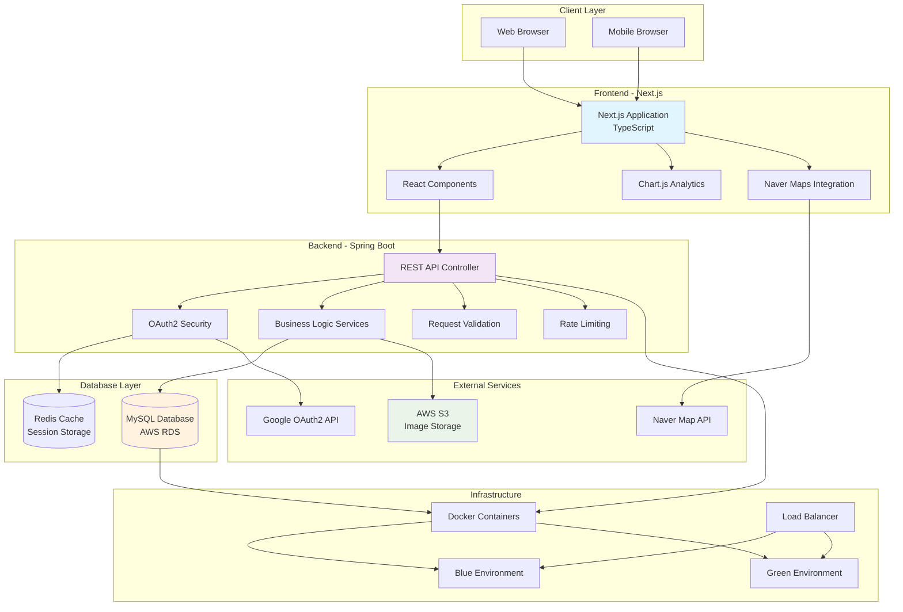
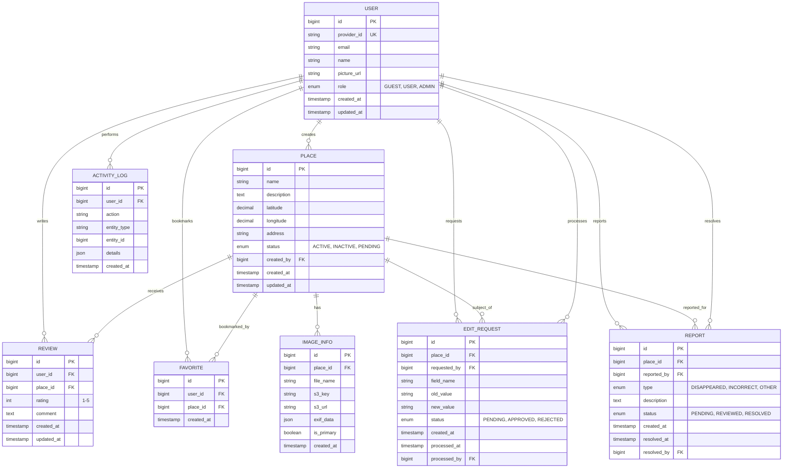
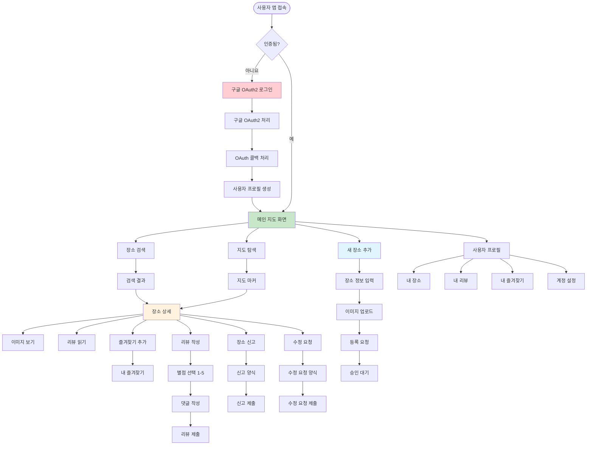
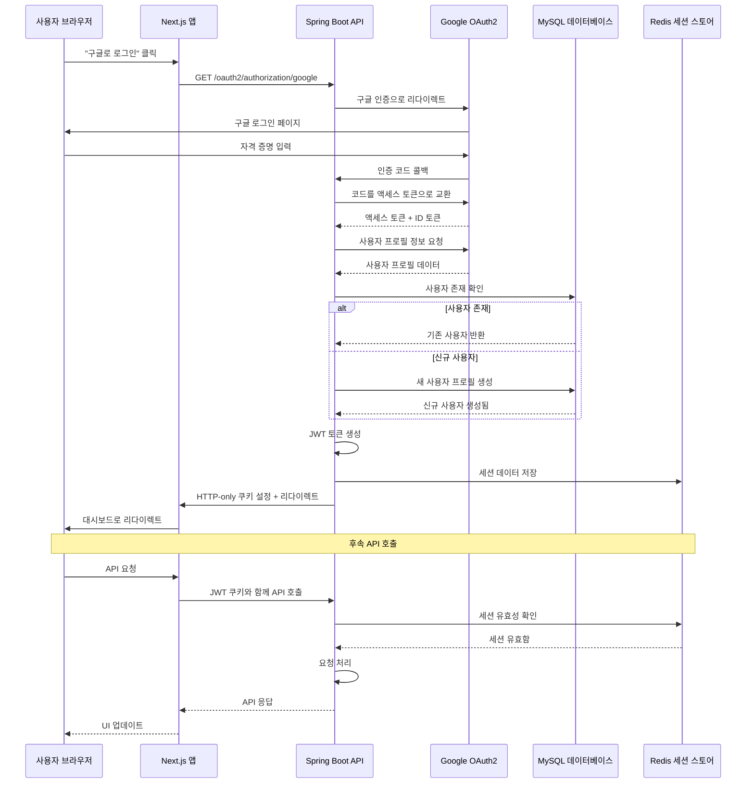
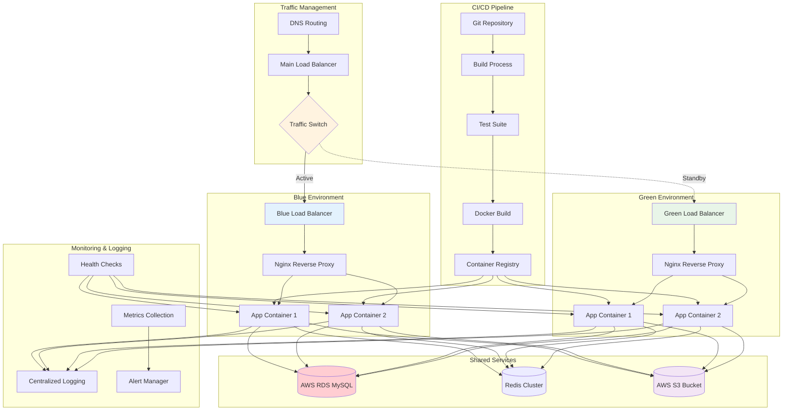
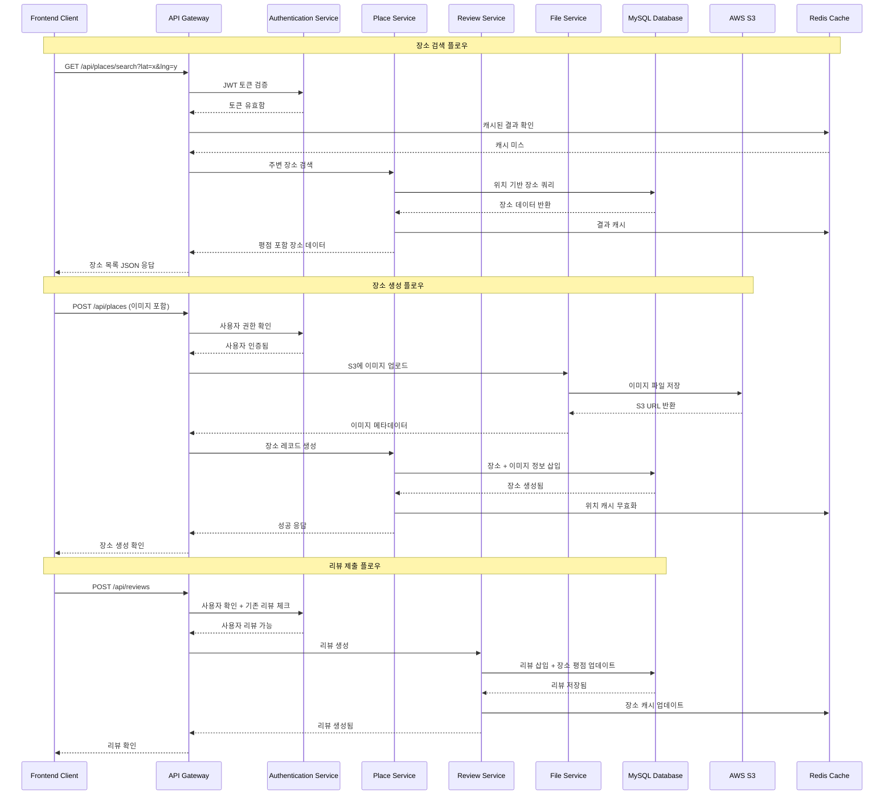

# 흡연 지도(Smoking Map) 시스템 아키텍처 보고서

## 📋 목차
1. [프로젝트 개요](#1-프로젝트-개요)
2. [시스템 아키텍처](#2-시스템-아키텍처)
3. [기술 스택](#3-기술-스택)
4. [데이터베이스 설계](#4-데이터베이스-설계)
5. [핵심 기능](#5-핵심-기능)
6. [보안 및 인증](#6-보안-및-인증)
7. [배포 및 인프라](#7-배포-및-인프라)
8. [시스템 플로우](#8-시스템-플로우)
9. [성능 최적화](#9-성능-최적화)
10. [모니터링 및 로깅](#10-모니터링-및-로깅)

---

## 1. 프로젝트 개요

**흡연 지도(Smoking Map)**는 사용자가 주변 흡연구역을 찾고 공유할 수 있는 커뮤니티 기반 웹 애플리케이션입니다.

### 1.1 주요 목표
- 🗺️ 지도 기반 흡연구역 검색 및 탐색
- 👥 커뮤니티 기반 콘텐츠 공유 및 관리
- ⭐ 리뷰 및 평점 시스템을 통한 품질 보장
- 🛡️ 관리자 도구를 통한 콘텐츠 모더레이션
- 📊 데이터 분석 및 대시보드 제공

### 1.2 핵심 가치
- **사용자 중심 설계**: 직관적인 UI/UX로 쉬운 사용성 제공
- **커뮤니티 기반**: 사용자 참여를 통한 콘텐츠 품질 향상
- **확장성**: 마이크로서비스 아키텍처로 향후 확장 고려
- **보안**: OAuth2 기반 안전한 인증 시스템

---

## 2. 시스템 아키텍처

### 2.1 전체 아키텍처 개요



### 2.2 아키텍처 특징

#### 2.2.1 계층형 아키텍처
- **프레젠테이션 계층**: Next.js 기반 프론트엔드
- **비즈니스 로직 계층**: Spring Boot 기반 백엔드
- **데이터 계층**: MySQL 데이터베이스와 Redis 캐시
- **외부 서비스 계층**: AWS S3, Google OAuth2, Naver Maps

#### 2.2.2 마이크로서비스 지향 설계
- **서비스 분리**: 각 도메인별 독립적인 서비스 구조
- **API 게이트웨이**: 중앙집중식 요청 처리
- **서비스 디스커버리**: Docker Compose 기반 서비스 연결

---

## 3. 기술 스택

### 3.1 백엔드 기술 스택

#### 3.1.1 핵심 프레임워크
- **Spring Boot 3.2.4**: 최신 스프링 프레임워크
- **Spring Security**: OAuth2 기반 보안
- **Spring Data JPA**: 데이터베이스 ORM
- **Spring Web**: RESTful API 개발

#### 3.1.2 데이터베이스 및 캐싱
- **MySQL 8.0**: 주 데이터베이스 (AWS RDS)
- **H2 Database**: 개발 및 테스트용
- **Redis**: 세션 저장 및 캐싱

#### 3.1.3 외부 서비스 연동
- **AWS SDK**: S3 이미지 저장소 연동
- **Spring Cloud AWS**: AWS 서비스 통합
- **OAuth2 Client**: Google 소셜 로그인

#### 3.1.4 유틸리티 라이브러리
- **Bucket4j**: API 요청 속도 제한
- **Metadata Extractor**: 이미지 EXIF 메타데이터 추출
- **ImgScalr**: 이미지 리사이징
- **Apache Commons Lang3**: 유틸리티 함수

### 3.2 프론트엔드 기술 스택

#### 3.2.1 핵심 프레임워크
- **Next.js 15.4.6**: React 기반 풀스택 프레임워크
- **React 18**: 최신 리액트 (서버 컴포넌트 지원)
- **TypeScript 5**: 타입 안전성 확보

#### 3.2.2 상태 관리 및 데이터
- **React Context**: 전역 상태 관리
- **Custom Hooks**: 재사용 가능한 로직
- **Fetch API**: 서버 통신

#### 3.2.3 UI 및 시각화
- **Chart.js**: 대시보드 차트
- **React Chart.js 2**: Chart.js React 래퍼
- **Naver Maps**: 지도 서비스
- **Tailwind CSS 4**: 유틸리티 기반 스타일링

#### 3.2.4 개발 도구
- **ESLint**: 코드 품질 검사
- **Jest**: 단위 테스트
- **Cypress**: E2E 테스트
- **React Testing Library**: 컴포넌트 테스트

### 3.3 인프라 및 배포
- **Docker & Docker Compose**: 컨테이너화
- **AWS RDS**: 관리형 MySQL 데이터베이스
- **AWS S3**: 이미지 저장소
- **Blue/Green Deployment**: 무중단 배포

---

## 4. 데이터베이스 설계

### 4.1 ERD (Entity Relationship Diagram)



### 4.2 주요 엔터티 설명

#### 4.2.1 USER (사용자)
```java
@Entity
public class User {
    @Id @GeneratedValue
    private Long id;
    
    @Column(unique = true)
    private String providerId;  // OAuth2 제공자 ID
    
    private String email;
    private String name;
    private String pictureUrl;
    
    @Enumerated(EnumType.STRING)
    private Role role;  // GUEST, USER, ADMIN
    
    // JPA Auditing
    private LocalDateTime createdAt;
    private LocalDateTime updatedAt;
}
```

#### 4.2.2 PLACE (장소)
```java
@Entity
public class Place {
    @Id @GeneratedValue
    private Long id;
    
    private String name;
    private String description;
    
    // 고정밀도 좌표 (소수점 8자리)
    @Column(precision = 11, scale = 8)
    private BigDecimal latitude;
    
    @Column(precision = 11, scale = 8)
    private BigDecimal longitude;
    
    private String originalAddress;
    private String roadAddress;
    
    @ManyToOne(fetch = FetchType.LAZY)
    private User createdBy;
    
    // 계산된 필드
    private Double averageRating;
    private Integer reviewCount;
    private Long viewCount;
    
    // 이미지 관리
    @OneToMany(mappedBy = "place", cascade = CascadeType.ALL)
    @OrderBy("isRepresentative DESC, id ASC")
    private List<ImageInfo> images = new ArrayList<>();
}
```

#### 4.2.3 IMAGE_INFO (이미지 정보)
```java
@Entity
public class ImageInfo {
    @Id @GeneratedValue
    private Long id;
    
    @ManyToOne(fetch = FetchType.LAZY)
    private Place place;
    
    private String fileName;
    private String s3Key;
    private String s3Url;
    
    @Column(columnDefinition = "JSON")
    private String exifData;  // EXIF 메타데이터
    
    private Boolean isRepresentative = false;
    private LocalDateTime createdAt;
}
```

### 4.3 데이터베이스 최적화 전략

#### 4.3.1 인덱싱 전략
```sql
-- 지리적 검색 최적화
CREATE INDEX idx_place_location ON place (latitude, longitude);

-- 사용자별 즐겨찾기 조회 최적화
CREATE UNIQUE INDEX idx_favorite_user_place ON favorite (user_id, place_id);

-- 리뷰 중복 방지 및 조회 최적화
CREATE UNIQUE INDEX idx_review_user_place ON review (user_id, place_id);

-- 활동 로그 시간순 조회 최적화
CREATE INDEX idx_activity_log_created_at ON activity_log (created_at DESC);
```

#### 4.3.2 성능 최적화
- **지연 로딩**: 연관 엔터티는 기본적으로 LAZY 로딩
- **배치 크기**: `@BatchSize(size = 50)` 적용으로 N+1 문제 해결
- **캐싱**: 자주 조회되는 데이터는 Redis 캐시 활용
- **페이징**: 대용량 데이터 조회 시 페이징 처리

---

## 5. 핵심 기능

### 5.1 사용자 플로우



### 5.2 주요 기능 상세

#### 5.2.1 지도 및 장소 관리
```typescript
// MapContainer.tsx - 핵심 지도 컴포넌트
interface Place {
  id: number;
  name: string;
  description: string;
  latitude: number;
  longitude: number;
  averageRating?: number;
  reviewCount: number;
  isFavorite?: boolean;
  images: ImageInfo[];
}

const MapContainer: React.FC<{ places: Place[] }> = ({ places }) => {
  const [map, setMap] = useState<naver.maps.Map | null>(null);
  const [markers, setMarkers] = useState<naver.maps.Marker[]>([]);
  const [selectedPlace, setSelectedPlace] = useState<Place | null>(null);
  
  // 지도 초기화 및 마커 표시
  useEffect(() => {
    if (map && places.length > 0) {
      updateMarkers(places);
    }
  }, [map, places]);
  
  // 마커 클릭 시 장소 상세 정보 표시
  const handleMarkerClick = (place: Place) => {
    setSelectedPlace(place);
    logActivity('place_view', 'Place', place.id);
  };
};
```

#### 5.2.2 이미지 업로드 및 처리
```java
@Service
public class S3Uploader {
    
    @Value("${spring.cloud.aws.s3.bucket}")
    private String bucket;
    
    private final AmazonS3 amazonS3;
    private final FileValidator fileValidator;
    
    public List<ImageInfo> uploadImages(List<MultipartFile> files, Place place) {
        List<ImageInfo> imageInfoList = new ArrayList<>();
        
        for (int i = 0; i < files.size(); i++) {
            MultipartFile file = files.get(i);
            
            // 1. 파일 유효성 검증
            fileValidator.validateImageFile(file);
            
            // 2. 이미지 리사이징
            MultipartFile resizedFile = resizeImage(file);
            
            // 3. EXIF 데이터 추출
            Map<String, Object> exifData = extractExifData(file);
            
            // 4. S3 업로드
            String fileName = generateFileName(place, i);
            String s3Url = uploadToS3(resizedFile, fileName);
            
            // 5. 데이터베이스 저장
            ImageInfo imageInfo = ImageInfo.builder()
                .place(place)
                .fileName(fileName)
                .s3Key(fileName)
                .s3Url(s3Url)
                .exifData(objectMapper.writeValueAsString(exifData))
                .isRepresentative(i == 0) // 첫 번째 이미지를 대표 이미지로
                .build();
                
            imageInfoList.add(imageInfo);
        }
        
        return imageInfoList;
    }
    
    private MultipartFile resizeImage(MultipartFile originalFile) {
        BufferedImage originalImage = ImageIO.read(originalFile.getInputStream());
        BufferedImage resizedImage = Scalr.resize(originalImage, 1200);
        // ... 리사이징 로직
    }
}
```

#### 5.2.3 리뷰 및 평점 시스템
```java
@Service
@Transactional
public class ReviewService {
    
    public ReviewResponseDto saveReview(Long placeId, ReviewRequestDto requestDto, User user) {
        Place place = placeRepository.findById(placeId)
            .orElseThrow(() -> new IllegalArgumentException("장소를 찾을 수 없습니다."));
        
        // 중복 리뷰 체크
        boolean alreadyReviewed = reviewRepository
            .existsByUserAndPlace(user, place);
        
        if (alreadyReviewed) {
            throw new IllegalArgumentException("이미 리뷰를 작성했습니다.");
        }
        
        // 리뷰 저장
        Review review = Review.builder()
            .user(user)
            .place(place)
            .rating(requestDto.getRating())
            .comment(requestDto.getComment())
            .build();
        
        reviewRepository.save(review);
        
        // 평점 업데이트
        updatePlaceRating(place);
        
        return new ReviewResponseDto(review);
    }
    
    private void updatePlaceRating(Place place) {
        ReviewStatsDto stats = reviewRepository.getReviewStats(place.getId());
        place.updateRating(stats.getAverageRating(), stats.getReviewCount());
        placeRepository.save(place);
    }
}
```

### 5.3 관리자 기능

#### 5.3.1 대시보드 및 분석
```java
@RestController
@RequestMapping("/api/v1/admin")
@PreAuthorize("hasRole('ADMIN')")
public class AdminApiController {
    
    @GetMapping("/dashboard")
    public ResponseEntity<DashboardResponseDto> getDashboard(
            @RequestParam(defaultValue = "week") String timeRange) {
        
        DashboardResponseDto dashboard = adminService.getDashboardStats(timeRange);
        return ResponseEntity.ok(dashboard);
    }
    
    @GetMapping("/dashboard/chart")
    public ResponseEntity<DashboardChartResponseDto> getChartData(
            @RequestParam(defaultValue = "week") String timeRange) {
        
        DashboardChartResponseDto chartData = adminService.getChartData(timeRange);
        return ResponseEntity.ok(chartData);
    }
}
```

#### 5.3.2 콘텐츠 모더레이션
```java
@Service
@Transactional
public class AdminService {
    
    public void approvePlace(Long placeId, User admin) {
        Place place = placeRepository.findById(placeId)
            .orElseThrow(() -> new EntityNotFoundException("장소를 찾을 수 없습니다."));
        
        place.approve();
        placeRepository.save(place);
        
        // 활동 로그 기록
        logAdminActivity(admin, "APPROVE_PLACE", place.getId());
        
        // 알림 발송 (필요시)
        notificationService.notifyPlaceApproval(place.getCreatedBy(), place);
    }
    
    public void processEditRequest(Long editRequestId, boolean approve, User admin) {
        EditRequest editRequest = editRequestRepository.findById(editRequestId)
            .orElseThrow(() -> new EntityNotFoundException("수정 요청을 찾을 수 없습니다."));
        
        if (approve) {
            // 수정 사항 적용
            applyEditChanges(editRequest);
            editRequest.approve(admin);
        } else {
            editRequest.reject(admin);
        }
        
        editRequestRepository.save(editRequest);
        logAdminActivity(admin, approve ? "APPROVE_EDIT" : "REJECT_EDIT", editRequest.getId());
    }
}
```

---

## 6. 보안 및 인증

### 6.1 OAuth2 인증 플로우



### 6.2 보안 구성

#### 6.2.1 Spring Security 설정
```java
@Configuration
@EnableWebSecurity
@EnableMethodSecurity(prePostEnabled = true)
public class SecurityConfig {

    @Bean
    public SecurityFilterChain filterChain(HttpSecurity http) throws Exception {
        http
            .csrf(csrf -> csrf
                .ignoringRequestMatchers("/api/v1/places/*/view", "/api/v1/reports")
                .csrfTokenRepository(CookieCsrfTokenRepository.withHttpOnlyFalse())
            )
            .sessionManagement(session -> session
                .sessionCreationPolicy(SessionCreationPolicy.IF_REQUIRED)
                .maximumSessions(1)
                .maxSessionsPreventsLogin(false)
            )
            .authorizeHttpRequests(authz -> authz
                .requestMatchers("/", "/api/v1/places/**").permitAll()
                .requestMatchers("/api/v1/admin/**").hasRole("ADMIN")
                .requestMatchers(HttpMethod.POST, "/api/v1/**").hasAnyRole("USER", "ADMIN")
                .anyRequest().authenticated()
            )
            .oauth2Login(oauth2 -> oauth2
                .loginPage("/login")
                .defaultSuccessUrl("/")
                .failureUrl("/login?error")
                .userInfoEndpoint(userInfo -> userInfo
                    .userService(customOAuth2UserService)
                )
                .successHandler(oAuth2SuccessHandler)
            );
        
        return http.build();
    }
}
```

#### 6.2.2 역할 기반 접근 제어 (RBAC)
```java
public enum Role {
    GUEST("ROLE_GUEST", "게스트"),
    USER("ROLE_USER", "일반 사용자"),
    MANAGER("ROLE_MANAGER", "매니저"),
    ADMIN("ROLE_ADMIN", "관리자");
    
    private final String key;
    private final String title;
}

// 컨트롤러에서 역할 기반 접근 제어
@PreAuthorize("hasRole('USER')")
@PostMapping("/places")
public ResponseEntity<Long> savePlaces(@Valid @RequestBody PlaceSaveRequestDto requestDto) {
    // 인증된 사용자만 장소 등록 가능
}

@PreAuthorize("hasRole('ADMIN')")
@DeleteMapping("/admin/places/{id}")
public ResponseEntity<Void> deletePlace(@PathVariable Long id) {
    // 관리자만 장소 삭제 가능
}
```

### 6.3 API 보안 및 제한

#### 6.3.1 요청 속도 제한 (Rate Limiting)
```yaml
# application.yml
bucket4j:
  enabled: true
  filters:
    # POST 요청 제한 (분당 10회)
    - cache-name: buckets
      id: post-rate-limit
      rate-limits:
        - bandwidths:
            - capacity: 10
              time: 1
              unit: minutes
      url-expression: "(/api/v1/places.*)|(/api/v1/reports.*)|(/api/v1/edit-requests.*)"
      http-method: POST

    # GET 요청 제한 (분당 100회)
    - cache-name: buckets
      id: get-rate-limit
      rate-limits:
        - bandwidths:
            - capacity: 100
              time: 1
              unit: minutes
      url-expression: "/api/v1/.*"
      http-method: GET
```

#### 6.3.2 파일 업로드 보안
```java
@Component
public class FileValidator {
    
    private static final List<String> ALLOWED_EXTENSIONS = 
        Arrays.asList("jpg", "jpeg", "png", "gif");
    private static final long MAX_FILE_SIZE = 10 * 1024 * 1024; // 10MB
    
    public void validateImageFile(MultipartFile file) {
        if (file.isEmpty()) {
            throw new IllegalArgumentException("파일이 비어있습니다.");
        }
        
        if (file.getSize() > MAX_FILE_SIZE) {
            throw new IllegalArgumentException("파일 크기가 10MB를 초과합니다.");
        }
        
        String originalFilename = file.getOriginalFilename();
        if (originalFilename == null || !hasAllowedExtension(originalFilename)) {
            throw new IllegalArgumentException("허용되지 않는 파일 형식입니다.");
        }
        
        // MIME 타입 검증
        String contentType = file.getContentType();
        if (contentType == null || !contentType.startsWith("image/")) {
            throw new IllegalArgumentException("이미지 파일만 업로드 가능합니다.");
        }
    }
}
```

---

## 7. 배포 및 인프라

### 7.1 배포 아키텍처



### 7.2 Docker 구성

#### 7.2.1 백엔드 Dockerfile
```dockerfile
# Dockerfile.backend
FROM amazoncorretto:17-al2023-headless

WORKDIR /app

# 빌드된 JAR 파일 복사
COPY build/libs/*.jar app.jar

# 포트 노출
EXPOSE 8080

# 애플리케이션 실행
ENTRYPOINT ["java", "-jar", "app.jar"]
```

#### 7.2.2 프론트엔드 Multi-stage Dockerfile
```dockerfile
# smoking_map_frontend/Dockerfile.frontend

# Stage 1: Build
FROM node:20-alpine AS builder
WORKDIR /app
COPY package*.json ./
RUN npm install
COPY . .

# 빌드 인수 설정
ARG NEXT_PUBLIC_API_URL
ENV NEXT_PUBLIC_API_URL=${NEXT_PUBLIC_API_URL}

ARG NEXT_PUBLIC_NAVER_MAP_CLIENT_ID
ENV NEXT_PUBLIC_NAVER_MAP_CLIENT_ID=${NEXT_PUBLIC_NAVER_MAP_CLIENT_ID}

ARG NEXT_PUBLIC_ADSENSE_CLIENT_ID
ENV NEXT_PUBLIC_ADSENSE_CLIENT_ID=${NEXT_PUBLIC_ADSENSE_CLIENT_ID}

ARG INTERNAL_API_URL
ENV INTERNAL_API_URL=${INTERNAL_API_URL}

RUN npm run build

# Stage 2: Production
FROM node:20-alpine
WORKDIR /app
COPY --from=builder /app/package*.json ./
RUN npm install --omit=dev
COPY --from=builder /app/.next ./.next
COPY --from=builder /app/public ./public
COPY --from=builder /app/next.config.mjs ./

EXPOSE 3000
CMD ["npm", "start"]
```

### 7.3 Docker Compose 설정

#### 7.3.1 프로덕션 환경 설정
```yaml
# docker-compose.yml (Blue/Green V1.1.0)
version: '3.8'
services:
  backend:
    build:
      context: .
      dockerfile: Dockerfile.backend
    container_name: smoking_map_backend_green
    ports:
      - "8081:8080"  # Green environment port
    volumes:
      - /var/log/smoking_map:/logs
    environment:
      - SPRING_PROFILES_ACTIVE=prod
    env_file: ./.env
    restart: always

  frontend:
    build:
      context: ./smoking_map_frontend
      dockerfile: Dockerfile.frontend
      args:
        - NEXT_PUBLIC_API_URL=${NEXT_PUBLIC_API_URL}
        - NEXT_PUBLIC_NAVER_MAP_CLIENT_ID=${NEXT_PUBLIC_NAVER_MAP_CLIENT_ID}
        - NEXT_PUBLIC_ADSENSE_CLIENT_ID=${NEXT_PUBLIC_ADSENSE_CLIENT_ID}
        - INTERNAL_API_URL=${INTERNAL_API_URL}
    container_name: smoking_map_frontend_green
    ports:
      - "3001:3000"  # Green environment port
    env_file: ./.env
    restart: always
```

### 7.4 Blue/Green 배포 전략

#### 7.4.1 배포 스크립트
```bash
#!/bin/bash
# start.sh - 무중단 배포 스크립트

# .env 파일이 있는지 확인
if [ -f .env ]; then
  # .env 파일의 변수들을 환경변수로 export
  export $(cat .env | sed 's/#.*//g' | xargs)
fi

# 현재 활성 환경 확인
CURRENT_ENV=$(docker ps --format "table {{.Names}}" | grep -E "blue|green" | head -1 | grep -o -E "blue|green")

if [ "$CURRENT_ENV" = "blue" ]; then
    NEW_ENV="green"
    NEW_PORT="8081"
    OLD_PORT="8080"
else
    NEW_ENV="blue" 
    NEW_PORT="8080"
    OLD_PORT="8081"
fi

echo "Current environment: $CURRENT_ENV"
echo "Deploying to: $NEW_ENV"

# 새 환경 빌드 및 시작
docker-compose -f docker-compose-$NEW_ENV.yml up -d --build

# 새 환경 헬스 체크
echo "Waiting for $NEW_ENV environment to be ready..."
for i in {1..30}; do
    if curl -f http://localhost:$NEW_PORT/actuator/health > /dev/null 2>&1; then
        echo "$NEW_ENV environment is ready!"
        break
    fi
    sleep 10
done

# 트래픽 전환 (로드 밸런서 설정 변경)
echo "Switching traffic to $NEW_ENV environment..."
# 실제 환경에서는 로드 밸런서 설정 변경 로직이 필요

# 구 환경 정리
echo "Stopping $CURRENT_ENV environment..."
docker-compose -f docker-compose-$CURRENT_ENV.yml down

echo "Deployment completed successfully!"
```

### 7.5 AWS 인프라 구성

#### 7.5.1 데이터베이스 (RDS)
```yaml
# AWS RDS MySQL 설정
Database:
  Engine: MySQL 8.0
  Instance: db.t3.micro
  Storage: 20GB SSD
  Multi-AZ: true (고가용성)
  Backup: 7일 보관
  Security Group: Backend access only
  
Connection:
  Host: smoking-map-db.cromckm028az.ap-northeast-2.rds.amazonaws.com
  Port: 3306
  Database: smoking_map_db
  SSL: false
  Timezone: Asia/Seoul
  Character Set: UTF-8
```

#### 7.5.2 이미지 저장소 (S3)
```yaml
# AWS S3 버킷 설정
Bucket:
  Name: smoking-map-images-kknd03255
  Region: ap-northeast-2
  Versioning: false
  Public Access: Block all
  
Storage Classes:
  Standard: 현재 이미지 (30일)
  IA: 이전 이미지 (90일)
  Glacier: 아카이브 (1년 이상)
  
Security:
  Encryption: AES-256
  Access: IAM 역할 기반
  CORS: Frontend domain 허용
```

---

## 8. 시스템 플로우

### 8.1 API 호출 플로우



### 8.2 관리자 워크플로우

```mermaid
graph TD
    ADMIN_LOGIN([관리자 로그인]) --> ADMIN_DASHBOARD[관리자 대시보드]
    
    ADMIN_DASHBOARD --> ANALYTICS[분석 보기]
    ADMIN_DASHBOARD --> MANAGE_PLACES[장소 관리]
    ADMIN_DASHBOARD --> MANAGE_USERS[사용자 관리]
    ADMIN_DASHBOARD --> MODERATION[콘텐츠 모더레이션]
    ADMIN_DASHBOARD --> SYSTEM_LOGS[시스템 활동 로그]
    
    ANALYTICS --> USER_STATS[사용자 통계]
    ANALYTICS --> PLACE_STATS[장소 통계]
    ANALYTICS --> REVIEW_STATS[리뷰 분석]
    ANALYTICS --> CHARTS[차트 생성]
    
    MANAGE_PLACES --> PENDING_PLACES[승인 대기 장소]
    MANAGE_PLACES --> ALL_PLACES[전체 장소 목록]
    MANAGE_PLACES --> SEARCH_PLACES[장소 검색]
    
    PENDING_PLACES --> REVIEW_PLACE{장소 검토}
    REVIEW_PLACE -->|승인| APPROVE_PLACE[장소 승인]
    REVIEW_PLACE -->|거부| REJECT_PLACE[장소 거부]
    REVIEW_PLACE -->|수정 요청| REQUEST_CHANGES[수정 요청]
    
    ALL_PLACES --> EDIT_PLACE[장소 정보 수정]
    ALL_PLACES --> DELETE_PLACE[장소 삭제]
    ALL_PLACES --> VIEW_PLACE_REPORTS[장소 신고 보기]
    
    MANAGE_USERS --> USER_LIST[사용자 목록]
    MANAGE_USERS --> USER_ROLES[사용자 역할 관리]
    MANAGE_USERS --> BANNED_USERS[차단된 사용자]
    
    USER_LIST --> VIEW_USER_ACTIVITY[사용자 활동 보기]
    USER_LIST --> CHANGE_USER_ROLE[사용자 역할 변경]
    USER_LIST --> BAN_USER[사용자 차단]
    
    MODERATION --> PENDING_REPORTS[대기중인 신고]
    MODERATION --> EDIT_REQUESTS[수정 요청 큐]
    MODERATION --> FLAGGED_CONTENT[신고된 콘텐츠]
    
    PENDING_REPORTS --> REVIEW_REPORT{신고 검토}
    REVIEW_REPORT -->|유효| RESOLVE_REPORT[신고 해결]
    REVIEW_REPORT -->|무효| DISMISS_REPORT[신고 기각]
    REVIEW_REPORT -->|조치| MODERATE_PLACE[장소 조치]
    
    EDIT_REQUESTS --> REVIEW_EDIT{수정 요청 검토}
    REVIEW_EDIT -->|승인| APPLY_EDIT[변경사항 적용]
    REVIEW_EDIT -->|거부| REJECT_EDIT[수정 거부]
    
    SYSTEM_LOGS --> ACTIVITY_LOGS[활동 로그 보기]
    SYSTEM_LOGS --> ERROR_LOGS[오류 로그 보기]
    SYSTEM_LOGS --> AUDIT_TRAIL[감사 추적]
    
    style ADMIN_DASHBOARD fill:#f3e5f5
    style MODERATION fill:#ffcdd2
    style ANALYTICS fill:#e8f5e8
    style MANAGE_PLACES fill:#fff3e0
```



---

## 9. 성능 최적화

### 9.1 백엔드 성능 최적화

#### 9.1.1 데이터베이스 최적화
```java
// N+1 문제 해결을 위한 배치 페치
@Entity
@BatchSize(size = 50)
public class Place {
    @OneToMany(mappedBy = "place", fetch = FetchType.LAZY)
    private List<ImageInfo> images;
    
    @OneToMany(mappedBy = "place", fetch = FetchType.LAZY)
    private List<Review> reviews;
}

// 지리적 검색 최적화를 위한 커스텀 쿼리
@Query("""
    SELECT p FROM Place p 
    WHERE p.latitude BETWEEN :minLat AND :maxLat 
    AND p.longitude BETWEEN :minLng AND :maxLng
    AND p.status = com.smoking_map.domain.place.PlaceStatus.ACTIVE
    ORDER BY (6371 * acos(cos(radians(:lat)) * cos(radians(p.latitude)) * 
             cos(radians(p.longitude) - radians(:lng)) + 
             sin(radians(:lat)) * sin(radians(p.latitude))))
    """)
List<Place> findNearbyPlaces(
    @Param("lat") BigDecimal lat, @Param("lng") BigDecimal lng,
    @Param("minLat") BigDecimal minLat, @Param("maxLat") BigDecimal maxLat,
    @Param("minLng") BigDecimal minLng, @Param("maxLng") BigDecimal maxLng,
    Pageable pageable
);
```

#### 9.1.2 캐싱 전략
```java
@Service
public class PlaceService {
    
    @Cacheable(value = "places", key = "#lat + '_' + #lng + '_' + #radius")
    public List<PlaceResponseDto> findNearbyPlaces(BigDecimal lat, BigDecimal lng, int radius) {
        List<Place> places = placeRepository.findNearbyPlaces(lat, lng, radius);
        return places.stream()
            .map(this::convertToDto)
            .collect(Collectors.toList());
    }
    
    @CacheEvict(value = "places", allEntries = true)
    public Long savePlace(PlaceSaveRequestDto requestDto) {
        // 새 장소 등록 시 캐시 무효화
    }
}
```

#### 9.1.3 이미지 최적화
```java
@Service
public class S3Uploader {
    
    private MultipartFile optimizeImage(MultipartFile originalFile) throws IOException {
        BufferedImage originalImage = ImageIO.read(originalFile.getInputStream());
        
        // 1. 이미지 리사이징 (최대 1200px 너비)
        BufferedImage resizedImage = Scalr.resize(
            originalImage, 
            Scalr.Method.QUALITY, 
            1200
        );
        
        // 2. JPEG 압축률 조정 (품질 85%)
        ByteArrayOutputStream baos = new ByteArrayOutputStream();
        ImageWriter writer = ImageIO.getImageWritersByFormatName("jpg").next();
        ImageWriteParam param = writer.getDefaultWriteParam();
        param.setCompressionMode(ImageWriteParam.MODE_EXPLICIT);
        param.setCompressionQuality(0.85f);
        
        writer.setOutput(ImageIO.createImageOutputStream(baos));
        writer.write(null, new IIOImage(resizedImage, null, null), param);
        
        return new MockMultipartFile(
            originalFile.getName(),
            originalFile.getOriginalFilename(),
            "image/jpeg",
            baos.toByteArray()
        );
    }
}
```

### 9.2 프론트엔드 성능 최적화

#### 9.2.1 Next.js 최적화
```typescript
// app/page.tsx - Server-Side Rendering
export const dynamic = 'force-dynamic';

async function getPlaces(): Promise<Place[]> {
  try {
    // 서버 사이드에서는 내부 네트워크 사용
    const apiUrl = 'http://backend:8080';
    const res = await fetch(`${apiUrl}/api/v1/places`, { 
      cache: 'no-store'  // 항상 최신 데이터
    });
    
    if (!res.ok) return [];
    return res.json();
  } catch (error) {
    console.error('Error fetching places:', error);
    return [];
  }
}

export default async function Home() {
  const places = await getPlaces(); // 서버에서 미리 데이터 로드
  
  return (
    <div style={{ display: 'flex', flexDirection: 'column', height: '100vh' }}>
      <Header />
      <main style={{ flexGrow: 1, position: 'relative' }}>
        <MapContainer places={places} />
      </main>
    </div>
  );
}
```

#### 9.2.2 컴포넌트 최적화
```typescript
// components/MapContainer.tsx
import { memo, useCallback, useMemo } from 'react';

const MapContainer = memo(({ places }: { places: Place[] }) => {
  // 계산 비용이 높은 작업은 useMemo로 메모이제이션
  const mapOptions = useMemo(() => ({
    center: new naver.maps.LatLng(37.5666805, 126.9784147),
    zoom: 10,
    mapTypeControl: true,
    scaleControl: false,
    logoControl: false,
    mapDataControl: false,
    zoomControl: true,
  }), []);
  
  // 이벤트 핸들러는 useCallback으로 안정화
  const handleMarkerClick = useCallback((place: Place) => {
    setSelectedPlace(place);
    // 디바운싱된 활동 로깅
    debouncedLogActivity('place_view', 'Place', place.id);
  }, []);
  
  return (
    <div ref={mapRef} style={{ width: '100%', height: '100%' }}>
      {/* 지도 컴포넌트 */}
    </div>
  );
});
```

#### 9.2.3 이미지 로딩 최적화
```typescript
// components/PlaceDetail.tsx
import Image from 'next/image';

const PlaceDetail = ({ place }: { place: Place }) => {
  return (
    <div>
      {place.images.map((image, index) => (
        <Image
          key={image.id}
          src={image.s3Url}
          alt={place.name}
          width={400}
          height={300}
          priority={index === 0}  // 첫 번째 이미지만 우선 로딩
          placeholder="blur"
          blurDataURL="data:image/jpeg;base64,..."
          sizes="(max-width: 768px) 100vw, (max-width: 1200px) 50vw, 33vw"
        />
      ))}
    </div>
  );
};
```

---

## 10. 모니터링 및 로깅

### 10.1 애플리케이션 모니터링

#### 10.1.1 활동 로깅 시스템
```java
@Service
@Async
public class UserActivityLogService {
    
    public void logActivity(User user, String action, String entityType, Long entityId, Map<String, Object> details) {
        UserActivityLog log = UserActivityLog.builder()
            .user(user)
            .action(action)
            .entityType(entityType)
            .entityId(entityId)
            .details(objectMapper.writeValueAsString(details))
            .createdAt(LocalDateTime.now())
            .build();
        
        userActivityLogRepository.save(log);
        
        // 중요한 활동은 별도 알림
        if (isImportantActivity(action)) {
            alertService.sendAlert(log);
        }
    }
    
    // 통계 생성을 위한 집계 쿼리
    public Map<String, Long> getActivityStats(LocalDateTime startDate, LocalDateTime endDate) {
        List<Object[]> results = userActivityLogRepository
            .countActivitiesByAction(startDate, endDate);
        
        return results.stream()
            .collect(Collectors.toMap(
                row -> (String) row[0],   // action
                row -> (Long) row[1]      // count
            ));
    }
}
```

#### 10.1.2 헬스 체크 및 메트릭
```java
@RestController
@RequestMapping("/actuator")
public class HealthController {
    
    @GetMapping("/health")
    public ResponseEntity<Map<String, Object>> health() {
        Map<String, Object> status = new HashMap<>();
        
        // 데이터베이스 연결 확인
        status.put("database", checkDatabaseHealth());
        
        // Redis 연결 확인  
        status.put("redis", checkRedisHealth());
        
        // S3 연결 확인
        status.put("s3", checkS3Health());
        
        // 전체 상태 결정
        boolean isHealthy = status.values().stream()
            .allMatch(health -> "UP".equals(health));
        
        status.put("status", isHealthy ? "UP" : "DOWN");
        
        return ResponseEntity.ok(status);
    }
    
    @GetMapping("/metrics")
    public ResponseEntity<Map<String, Object>> metrics() {
        Map<String, Object> metrics = new HashMap<>();
        
        // JVM 메트릭
        metrics.put("jvm.memory.used", getUsedMemory());
        metrics.put("jvm.memory.max", getMaxMemory());
        
        // 애플리케이션 메트릭
        metrics.put("places.total", placeRepository.count());
        metrics.put("users.total", userRepository.count());
        metrics.put("reviews.total", reviewRepository.count());
        
        return ResponseEntity.ok(metrics);
    }
}
```

### 10.2 프론트엔드 모니터링

#### 10.2.1 사용자 활동 추적
```typescript
// utils/analytics.ts
export const logActivity = async (
  action: string, 
  entityType: string, 
  entityId: number, 
  details: Record<string, any> = {}
) => {
  try {
    await fetch('/api/v1/activity-logs', {
      method: 'POST',
      headers: {
        'Content-Type': 'application/json',
        'X-XSRF-TOKEN': getCsrfToken(),
      },
      body: JSON.stringify({
        action,
        entityType,
        entityId,
        details: {
          ...details,
          timestamp: new Date().toISOString(),
          userAgent: navigator.userAgent,
          url: window.location.href
        }
      }),
    });
  } catch (error) {
    console.error('Failed to log activity:', error);
  }
};

// 디바운스된 활동 로깅 (성능 최적화)
export const debouncedLogActivity = debounce(logActivity, 1000);
```

#### 10.2.2 Google Analytics 통합
```typescript
// components/GoogleTagManager.tsx
const GoogleTagManager = () => {
  const GA_ID = process.env.NEXT_PUBLIC_GA_ID;
  
  if (!GA_ID) return null;
  
  return (
    <>
      <Script
        strategy="afterInteractive"
        src={`https://www.googletagmanager.com/gtag/js?id=${GA_ID}`}
      />
      <Script
        id="gtag-init"
        strategy="afterInteractive"
        dangerouslySetInnerHTML={{
          __html: `
            window.dataLayer = window.dataLayer || [];
            function gtag(){dataLayer.push(arguments);}
            gtag('js', new Date());
            gtag('config', '${GA_ID}');
          `,
        }}
      />
    </>
  );
};
```

### 10.3 로그 관리

#### 10.3.1 구조화된 로깅
```java
@Slf4j
@RestController
public class PlaceApiController {
    
    @PostMapping("/places")
    public ResponseEntity<Long> savePlace(@Valid @RequestBody PlaceSaveRequestDto requestDto, 
                                          @LoginUser User user) {
        try {
            // 구조화된 로그 (JSON 형태)
            log.info("Place creation started - userId: {}, placeName: {}, location: [{}, {}]",
                user.getId(), requestDto.getName(), 
                requestDto.getLatitude(), requestDto.getLongitude());
            
            Long placeId = placeService.save(requestDto, user);
            
            log.info("Place created successfully - userId: {}, placeId: {}, duration: {}ms",
                user.getId(), placeId, System.currentTimeMillis());
            
            return ResponseEntity.ok(placeId);
            
        } catch (Exception e) {
            log.error("Place creation failed - userId: {}, error: {}", 
                user.getId(), e.getMessage(), e);
            throw e;
        }
    }
}
```

#### 10.3.2 로그 설정 (logback-spring.xml)
```xml
<configuration>
    <!-- 콘솔 출력 -->
    <appender name="CONSOLE" class="ch.qos.logback.core.ConsoleAppender">
        <encoder class="net.logstash.logback.encoder.LogstashEncoder">
            <includeContext>true</includeContext>
            <includeMdc>true</includeMdc>
        </encoder>
    </appender>
    
    <!-- 파일 출력 -->
    <appender name="FILE" class="ch.qos.logback.core.rolling.RollingFileAppender">
        <file>/logs/smoking-map.log</file>
        <rollingPolicy class="ch.qos.logback.core.rolling.TimeBasedRollingPolicy">
            <fileNamePattern>/logs/smoking-map-%d{yyyy-MM-dd}.log</fileNamePattern>
            <maxHistory>30</maxHistory>
        </rollingPolicy>
        <encoder class="net.logstash.logback.encoder.LogstashEncoder"/>
    </appender>
    
    <!-- 에러 전용 로그 -->
    <appender name="ERROR_FILE" class="ch.qos.logback.core.rolling.RollingFileAppender">
        <filter class="ch.qos.logback.classic.filter.LevelFilter">
            <level>ERROR</level>
            <onMatch>ACCEPT</onMatch>
            <onMismatch>DENY</onMismatch>
        </filter>
        <file>/logs/smoking-map-error.log</file>
        <encoder class="net.logstash.logback.encoder.LogstashEncoder"/>
    </appender>
    
    <root level="INFO">
        <appender-ref ref="CONSOLE"/>
        <appender-ref ref="FILE"/>
        <appender-ref ref="ERROR_FILE"/>
    </root>
</configuration>
```

---

## 결론

흡연 지도(Smoking Map) 시스템은 현대적인 웹 개발 기술을 활용하여 구축된 커뮤니티 기반 위치 서비스 플랫폼입니다. 

### 주요 성과
- **🎯 사용자 중심 설계**: 직관적인 지도 인터페이스와 간편한 장소 등록
- **🔒 강력한 보안**: OAuth2 기반 인증과 역할 기반 접근 제어
- **📊 데이터 기반 의사결정**: 실시간 대시보드와 상세한 분석 도구
- **🚀 확장 가능한 아키텍처**: 마이크로서비스 지향 설계와 컨테이너 기반 배포
- **⚡ 최적화된 성능**: 캐싱, 이미지 최적화, CDN 활용

### 기술적 하이라이트
- **백엔드**: Spring Boot 3.2.4 + MySQL + Redis + AWS S3
- **프론트엔드**: Next.js 15 + TypeScript + Naver Maps + Chart.js  
- **배포**: Docker + Blue/Green 무중단 배포
- **모니터링**: 구조화된 로깅 + Google Analytics + 실시간 헬스 체크

### 향후 확장 방향
- **모바일 앱**: React Native 기반 네이티브 앱 개발
- **AI 추천**: 사용자 선호도 기반 장소 추천 시스템
- **실시간 기능**: WebSocket 기반 실시간 알림
- **국제화**: 다국어 지원 및 글로벌 서비스 확장

이 시스템은 사용자 경험, 기술적 우수성, 운영 안정성을 모두 고려한 종합적인 솔루션으로, 지속적인 성장과 확장이 가능한 견고한 기반을 제공합니다.